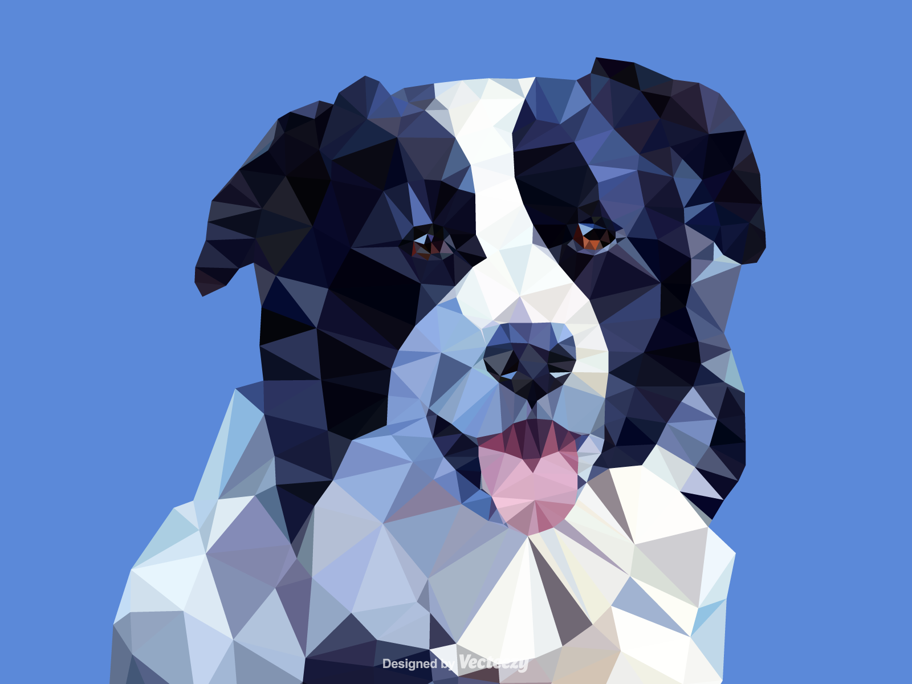

# Low Poly Maker

Check out the website [here](https://low-poly-maker.netlify.app/)! This repository contains the code for the website, including the generation code. No images are stored anywhere and all the work is done in your browser with Javascript.

Low Poly is a minimalistic art style that demphasizes finer details by representing features with polygons. The edges of the polygons serve as the detail in the image as the polygon itself is monocolor. Here is an example:

*<a href="https://www.vecteezy.com/free-vector/low-poly-animal">Low Poly Animal Vectors by Vecteezy</a>*

Something like this is custom made by a digital artist and can be quite time consuming and is frankly too hard to do for any amatuer who just wants an interesting picture. This project was made to automate this process, so anyone can easily create low poly renditions for themselves.

## Instructions
The progress bar at the top of the screen shows what step you are at and can be clicked to navigate between the different stages. 

First, upload an image. Any extension that is supported by HTML canvas can be used without problems. Then, adjust the generation settings. There are two variables `threshold` and `num_vertices`. The `threshold` variable determines shape and location of the triangles. A high value (e.g. 1000) means the triangles will more strongly align to the original image's curves and shape. A low value (e.g. 0.001) will result in an output image with triangles roughly all the same shape that are more evenly distributed around the original image. The `num_vertices` variable is for how many triangles there are in the output image. A higher number here will result in more triangles in the final image.

You can keep re-generating the image with whatever preferences you would like until you get one that looks the best. Then, just click the download button to download the image.

## Technical Details
### Tools Used
- Vue 3 (Composition API)
- Tailwind CSS
- Daisy UI
- Vite
- Netlify

### Image Manipulation
There is a four step process for converting an image into its low poly representation.

1. Detect Edges
2. Generate Vertices
3. Draw Polygons
4. Color in Shapes

For edge detection, a variety of algorithms can be used. Essentially, an edge can be found in an image by seeing how much the pixel intensity changes from nearby pixels. If the nearby pixels are close in color, there is no edge. In this project [lena.js](https://github.com/davidsonfellipe/lena.js/) is used to apply an edge detection filter to the image. The result after this step is a grayscale image with mostly values of zero where there are no edges, and higher values where there are edges.

With these edges, an accept-reject sampling algorithm is used to randomly select points on the image that correspond to the edges. The process is as follows:

1. Randomly select points on the edge detected image 
2. If the value of the point divided by a random amount exceeds the `threshold`, keep the point as a vertex
3. Repeat this process until there are `n` vertices

After this process, there will be `n` vertices generally located at points where there are edges. Four vertices are manually placed at each corner as well. From this, triangles can be drawn connecting the vertices using a algorithm called [Delaunay triangulation](https://en.wikipedia.org/wiki/Delaunay_triangulation). This algorithm has a special property that states that within any circle made from the verticies of any triangle there are no other vertices. Essentially, this ensures the final result will not have triangles that stretch too far. This process is done in the code using [Delanuator](https://github.com/mapbox/delaunator). Once the polygons are created, they still need to be filled in with a color similar to the original image. Currently, the average color of the three vertices used to create the triangle are used.
